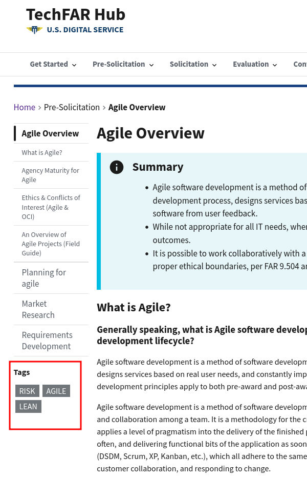

# Frontmatter

Frontmatter is the metadata the system uses to know how to build the site. It controls page URLs, title tags, headings, and more. While not all frontmatter items show up directly on a page, they will control how the page is displayed around the site. 

The frontmatter is at the top of each markdown file, separated by three hyphens at the top and the bottom. It looks like this:

```yaml
---
slug: page-url
heading: A cool page
template: default
promo_description: Here's what this page is about
nav_weight: 10
tags:
  - risk
  - contracts
---
```

The general format is as `key: value`, where the key is the word to the left of the colon and the value is to the right. Keys contain lower-case letters and underscores. Values can contain just about any text.

Almost all pages will have the following frontmatter:

- [slug](#slug): part of the page's URL
- heading: the large heading at the top of a page. Also, by default, the page's title tag
- promo_description: text used when the page shows up elsewhere on the site, like in a listing. Also, by default, the page's meta description for search.
- [nav_weight](#nav_weight): how the page will be ordered in any local navigation or listing page
- [template](page-templates.md): which layout and features the page will have. See [page templates](page-templates.md) for more details.
- [tags](#tags): a list of topical keywords to help associate related pages

There are a few less-frequently used frontmatter keys that you'll want to know about, too:

- link: To allow us to have content that shows up on listing pages but then just links to some other content, like a download. See [static files and aliases](static-files-and-aliases.md) for more information.
- meta_title: If you want the title tag (used by search engines) to differ from the `heading`, this will give you that control.
- meta_description: If you want the meta description (used by search engines) to differ from the `promo_description`, this will give you that control.
- robots: If you need to set the meta robots value, so that you can control search indexing and crawling, this will give you that control.
- canonical: If you need to set a `rel='canonical'` URL for a page, because it duplicates some other page substantially, this will give you that control.

A few of the above deserve greater explanation.

## `slug`

The slug is part of the page's URL, _mostly_ (imagine that was written ominously). 

Page URLs are built-up by taking the folder(s) they are in and appending the slug to the end, except in the special case of "index" pages (described below). So, in the common case, for the [Price Evaluation](https://github.com/usds/techfar-hub-website-v3/blob/main/tech-far-hub/content/evaluation/price-evaluation.mdx) page, the page is in the evaluation folder, and then has a slug of `price-evaluation`, so its URL is `https://techfarhub.usds.gov/evaluation/price-evaluation/`

If there are multiple folders, they are incorporated into the URL. For the [VA dot dov Modernization case study](https://github.com/usds/techfar-hub-website-v3/blob/main/tech-far-hub/content/resources/case-studies/va-dot-gov-modernization.mdx), the page is in the `case-studies`  folder, which is in the `resources` folder. The page has a slug of `va-dot-gov-modernization`, so the URL will be `https://techfarhub.usds.gov/resouces/case-studies/va-dot-gov-modernization/`


### Index pages

You might now be wondering, "cool, I see how the folders end up in the URLs, but how do I get a page with the URL `https://techfarhub.usds.gov/resources/case-studies/` since that's a folder, not a markdown file? The answer is you create a markdown file in that folder called `index.mdx` and give it the slug `slug: index`. That tells the system "this is the content for the page with the name of this folder." If that's strange to you, blame early web developers for the convention.


## `nav_weight`

Almost every page on the site shows up on some sort of navigation ---

* pages in _Get Started_, _Pre-Solicitation_, _Solicitation_, _Evaluation_, and _Contract Administration_ have local navigation, where every page links to its siblings in its left-rail:

    
* Pages in the various resources areas, like the _Learning Center_ and _Case Studies_ have listings of their child pages on the index page for the folder. For example, case studies look like:

    

In any of these cases where the site is generating a list of links, the `nav_weight` controls the order. The metaphor here is floating: items with a lower `nav_weight` are "lighter" and therefore higher in the order.

Looking at existing pages, nav weights are generally in increments of 10. We did this when initially building the site to make it easy to slot in new pages between existing ones --- so if we wanted to put a case study between _How the Pay.gov Team Went Agile_ and _The Acquisition that Helped the Department of Veterans Affairs Modernize Its Claims Appeals System_, we could give the new page a nav-weight of 15 and it would land there.

## `tags`

The site is primarily organized hierarchically, using folders to group pages. However, content relates in multiple ways _across_ our hierarchy. To convey these relationships and improve content discovery, we use both hyperlinks in page content and _tags_ about the pages. The list of tags is an indented unordered markdown list. So, `tags:` in frontmatter might look like:

```yaml
tags:
  - risk
  - agile
  - lean
```

These will then render in the page's left rail, under the local navigation:



Clicking a tag brings a user to a list of all the pages tagged with that page:


Note that the listings use the `heading:` for the heading of the box and the `promo_description:` (if any) for content below the heading. 