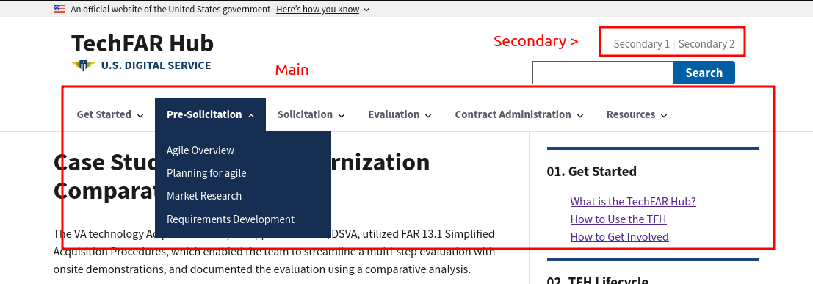
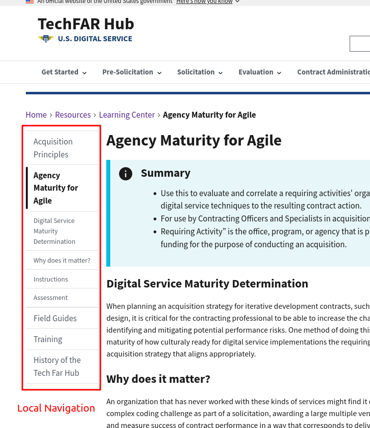
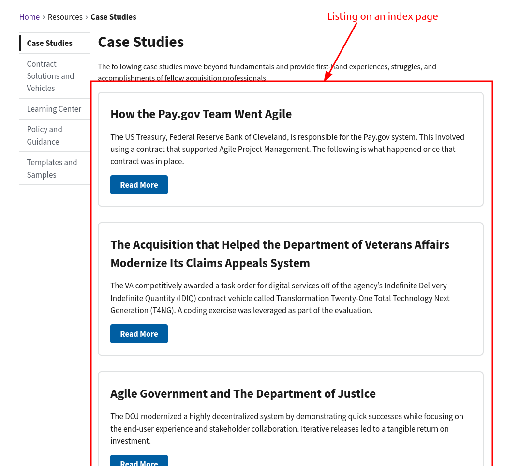

# Navigation<!-- omit in toc -->

TechFAR Hub has a couple different kinds of navigation that you might want to edit, so this page will cover all of them.

- [Global Navigation](#global-navigation)
  - [The main global navigation](#the-main-global-navigation)
  - [Secondary global navigation](#secondary-global-navigation)
  - [The footer](#the-footer)
- [Local, page-level navigation](#local-page-level-navigation)
- [Tags](#tags)

The [Global Main Navigation](#global-main-navigation) and [The footer](#the-footer) are the same on every page and appear on every page, and they allow visitors to go from any part of the site to any other. They are manually controlled via [YAML files](https://learnxinyminutes.com/docs/yaml/) and can be edited by site editors.

If you've never heard of YAML, please don't be too nervous, since it's the same format as in the [frontmatter](frontmatter.md) and so you've already secretly been editing YAML and just didn't realize it.

The [Local, page-level navigation](#local-page-level-navigation) and [Tags](#tags) are contextual and are generated based on a page's content, template, and place in the directories on the site.

## Global Navigation

The global navigation appears at the top of every page and has two parts:

- the main global navigation, which are the dropdown menus
- the secondary global navigation, which are optional links that can appear above the search box



There are both controlled in [`content/main-nav.yaml`](https://github.com/usds/techfar-hub-website-v3/blob/main/tech-far-hub/content/global-nav.yaml)


All items in the global navigation are build up from _link stanzas_ that look like this:

```yaml
- heading: The link text
  link: /the/link/url
```

These stanzas appear in several places, but they are the heart of configuring navigation.


### The main global navigation

In [`content/main-nav.yaml`](https://github.com/usds/techfar-hub-website-v3/blob/main/tech-far-hub/content/main-nav.yaml), you will see a heading `mainGlobalNavigation:` and a series of stanzas indented under it that look like these:

```yaml
mainGlobalNavigation:
  - heading: Get Started
    link: /get-started/
    children:
      - heading: Get Started
        link: /get-started/
      - heading: How to Use TFH
        link: /get-started/#how-to-use-techfar-hub
      - heading: DITAP
        link: /get-started/ditap/
  - heading: Pre-Solicitation
    link: /pre-solicitation/
    children:
      - heading: Agile Overview
        link: /pre-solicitation/agile-overview/
      - heading: Planning for agile
        link: /pre-solicitation/planning-for-agile/
      - heading: Market Research
        link: /pre-solicitation/market-research/
      - heading: Requirements Development 
        link: /pre-solicitation/requirements-development/
```

Each dropdown of the main global navigation is a _link stanza_ that has `children`, which are just a list of link stanzas. The items in the dropdown are the `children`. Read these like an outline --- the indentation of a list 

While you can technically add another top-level dropdown using this mechanism, you shouldn't; the design is setup for the number we have. You can, however, add, rephrase, and re-order links in the each dropdown by changing the `children` for a given dropdown.

You can and **should** add new pages under exsiting top-level drop-downs --- that's the whole point of this system.

### Secondary global navigation

After all of the configuration for the global navigation, there is a simple, two link configuration for `secondaryGlobalNavigation:` that, when filled out, looks like this:

```yaml
secondaryGlobalNavigation:  
     - heading: Secondary 1
       link: /url-for-secondary/link
     - heading: Secondary 2
       link: /second-url-for-second/link
```

It is a list of two links. Again, you could have more links, but it'll break the design, so just have two.

Note that, because it's optional, it might look like this:

```yaml
secondaryGlobalNavigation: []
```

The empty `[]` telling the system "this would be a list of links, but it's empty." If you want to add those links, delete the `[]` and add the two heading/link items indented like shown above.

### The footer

The footer is almost a combination of the above, although it has one unique feature --- the three social media links in the footer have a special form. 

In general, the footer's chunk of `global-nav.yaml` looks like:

```yaml
footerNavigation:
  facebookLink: "https://www.facebook.com/unitedstatesdigitalservice" 
  twitterLink: "https://twitter.com/USDS" 
  instagramLink: "https://www.instagram.com/usdigitalservice" 
  column1: 
    - heading: Get Started
      link: /get-started/
    - heading: Pre-Solicitation
      link: /pre-solicitation/
    - heading: Solicitation
      link: /solicitation/
```

The first three keys are, as they appear, the links to USDS's facebook, twitter, and instagram accounts. After that are three _column_ keys, one for each column on the desktop version of the footer:


As you might have surmised, the link stanzas under each of the column keys become the links in the footer. You can't add a column, but you can have as many links in each column as you want.

## Local, page-level navigation

Pages have local navigation in their left sidebar/rail:



The specific way the local navigation functions depends on the template the page uses.

- Pages in _Get Started_, _Pre-Solicitation_, _Solicitation_, _Evaluation_, and _Contract Administration_ use the default template and have local navigation, where every page links to its siblings in its left-rail. Additionally, these pages generate an _anchor link_ (a link to a part within the page itself) for all second level headings on the page `##`
- Listing pages, like the _Learning Center_ and _Case Studies_ have listings of their child pages on the index page for the folder. For example, case studies look like:

    

    These pages also generate _anchor links_ internally for all second-level headings.
- Specific case studies pages are a special case --- their local navigation ONLY takes level two headings into account; they don't link to sibling or child pages at all, since there are so many case studies.

  


In general, you need to be thoughtful with your second-level headings, since they form the core outline of your page and provide useful navigation to visitors.

- Some pages, like the resources page and the homepage, don't have local navigation at all, per-se, since they are entirely navigation anyway.


## Tags

To allow for topical content discovery that cuts across the site's main navigation, we also employ "tags," like what you would find on a blog. Tags are set per page, using the `tags:` [frontmatter](frontmatter.md#tags). As that page says,


```yaml
tags:
  - risk
  - agile
  - lean
```

These will then render in the page's left rail, under the local navigation:


Clicking a tag brings a user to a list of all the pages tagged with that page:


Note that the listings use the `heading:` for the heading of the box and the `promo_description:` (if any) for content below the heading. 

Tags are not centrally managed --- the list of possible tags on the site are the tags used on all the pages. Pick tags that can apply to multiple pages that exist in different sections of the site. For example, tagging all downloads, templates, handbook content, and case studies that pertain to BAAs with the tag "BAA" would allow users interested in that specific subject to find relevant content by clicking the tag. You can also link to the generate tag pages from within content, if you think an index of all content on a particular subject would be helpful for users who click that link.
