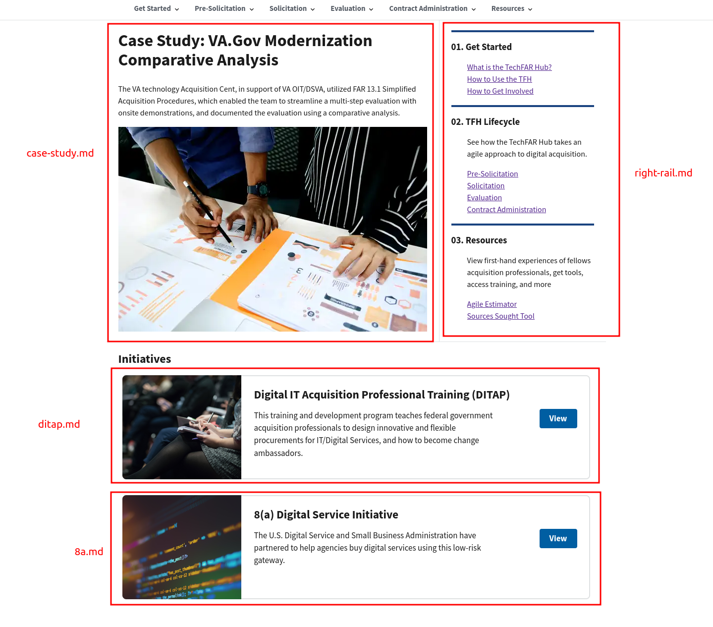
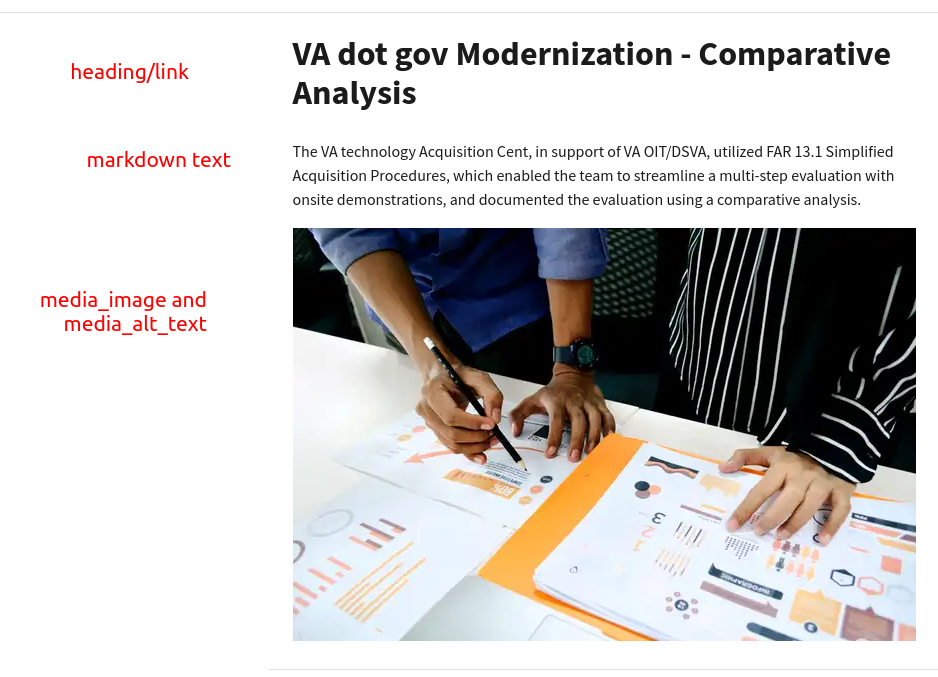

# The Homepage

Homepages are always special and weird, and not a group to break with tradition, so is the one for TechFAR Hub. This is because the homepage isn't a page like basically anything else on the site --- it's not a bunch of copy, nor is it a listing of other content. Instead, it's promos for content around the site.


To encapsulate this and keep it editable within github, we've added a concept of _content promos_, which are markdown files that can be used for a part of a page instead of a whole page. We use them to build the homepage and to build some elements that appear throughout the site, such as the "Resources" cards at the bottom of interior pages:


## The homepage promos

All of the promos for the homepage are in [`content/promos/homepage/`](https://github.com/usds/techfar-hub-website-v3/tree/main/tech-far-hub/content/promos/homepage):

- [`case-study.md`](https://github.com/usds/techfar-hub-website-v3/blob/main/tech-far-hub/content/promos/homepage/case-study.md) --- the main case study at the top left of the homepage
- [`right-rail.md`](https://github.com/usds/techfar-hub-website-v3/blob/main/tech-far-hub/content/promos/homepage/right-rail.md) --- the three blocks of links (i.e., "01. Get started", "02. TFH Lifecycle", "03. Resources") of the upper-right of the homepage.
- [`ditap.md`](https://github.com/usds/techfar-hub-website-v3/blob/main/tech-far-hub/content/promos/homepage/ditap.md) --- the DITAP initiative promo on the lower half of the page
- [`8a.md`](https://github.com/usds/techfar-hub-website-v3/blob/main/tech-far-hub/content/promos/homepage/8a.md) --- the 8(a) program initiative promo on the lower half of the page



## What's in a promo

The simplest promo is the right rail, so we'll start with that one and build up. It's a lot like a page --- it has the following frontmatter:

```yaml
---
promo_type: homepage-right-rail
---
```

The promo type tells the system where on the homepage to put this promo. There are 3 promo types used on the homepage:

- `homepage-right-rail`
- `case-study`
- `initiative`

Then, after the frontmatter, there is some markdown:

```markdown
### 01. Get Started

1. [What is the TechFAR Hub?](/get-started/)
2. [How to Use the TFH](/get-started/#how-to-use-techfar-hub)
3. [How to Get Involved](https://github.com/usds/techfar-hub-website-v3)

### 02. TFH Lifecycle

See how the TechFAR Hub takes an agile approach to digital acquisition.

1. [Pre-Solicitation](/pre-solicitation/)
2. [Solicitation](/solicitation/)
3. [Evaluation](/evaluation/)
4. [Contract Administration](/contract-administration/)

### 03. Resources

View first-hand experiences of fellows acquisition professionals, get tools, access training, and more

1. [Agile Estimator](/resources/templates-samples/agile-team-estimator/)
2. [Sources Sought Tool](#)
```

This is hopefully familiar, and if it's not, you should [read the markdown guide](basic-markdown.md) elsewhere in these docs. In this case, we've added a little bit of code to make those 3rd-level headings have the nice blue bars above them, and to remove the numbers in the ordered lists, so that the homepage rail looks right --- but overall this is a lot like the rest of the markdown on the rest of the site.

The other types of promo are similar.

## The case study promo

The (one and only) case study promo has more stuff in its frontmatter:

```yaml
---
promo_type: case-study
heading: VA dot gov Modernization - Comparative Analysis
link: /resources/case-studies/va-dot-gov-salesforce-coe/
media_image: ./img/ux-indonesia-8mikJ83LmSQ-unsplash.jpg
media_alt_text: A stock image of two people reviewing a presentation.
---
```

The `promo_type` was explained above. The heading is that large text at the top of the promo. The link is a URL to a page on the site --- in this case, the VA.gov salesforce COE case study. This should hopefully remind you of the frontmatter for [aliases](static-files-and-aliases.md) that you use to point to static files.

The next two fields are new:

1. the `media_image` points to an image in the [`/static/assets/img/`](https://github.com/usds/techfar-hub-website-v3/tree/main/tech-far-hub/static/assets/img) directory. You'll notice the path is a little weird though --- it starts with `./` and only has `img` after that before the image file name. The system we use for building the pages treats these sorts of images differently than others, so while you upload them the way you always would --- navigating in github to the [static assets folder, and adding them to img](https://github.com/usds/techfar-hub-website-v3/tree/main/tech-far-hub/static/assets/img), you then can refer to them with that shorthand path. The upshot is the system will automatically resize your image for you, which is pretty nice.
2. The `media_alt_text` field is a textual description of the image you're using, for visitors who are vision impaired or who might not be able to display images.

Finally, the text of the markdown file, after the frontmatter, is the text above the image.



## The initiative Promos

There are currently two "Initiative" promos, although you can have as many as you want on the site.

They're a lot like the case study promo. Here's the frontmatter of one:

```yaml
---
heading: Digital IT Acquisition Professional Training (DITAP)
promo_type: initiative
link: /get-started/ditap/
nav_weight: 10
media_image: ./img/the-climate-reality-project-Hb6uWq0i4MI-unsplash.jpg
media_alt_text: A stock image of people taking notes.
---
```

The only new field is the `nav_weight`, which controls the order they display and works like [`nav_weight`](frontmatter.md#nav_weight) everywhere on the site.

