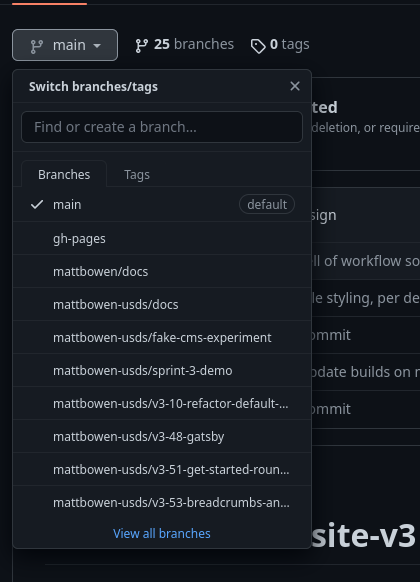
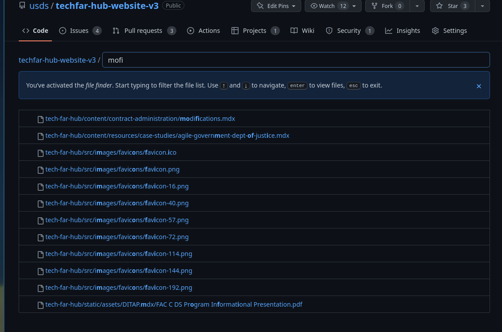
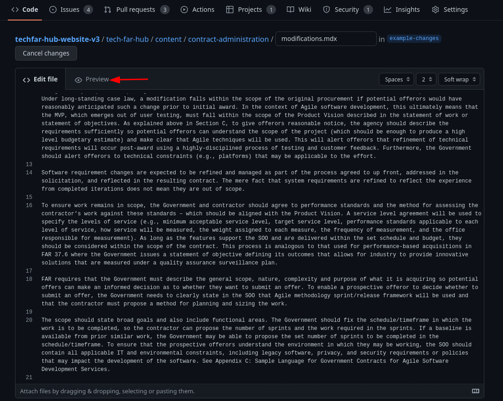
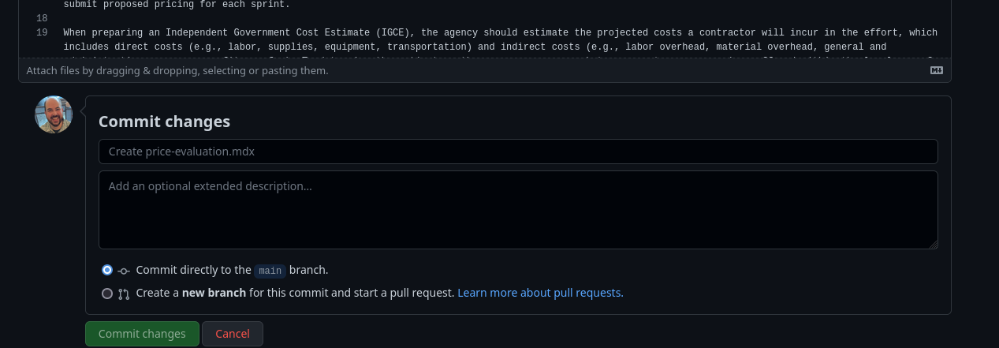
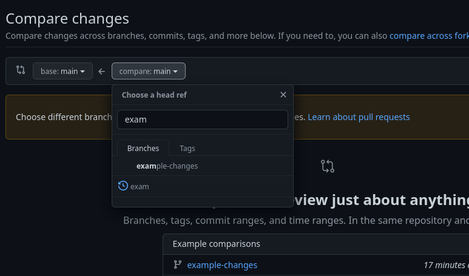
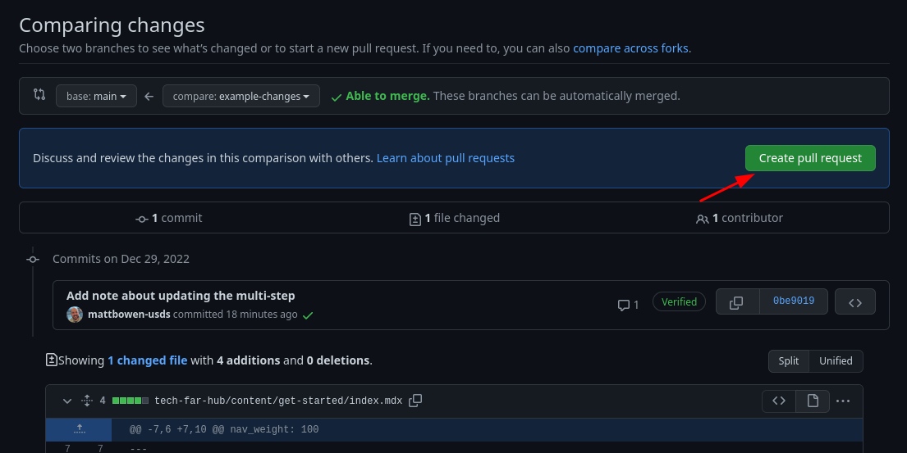

# Tutorial on editing existing content

This is a condensed version of [the github for content creators documentation](github-for-content.md), so if you read this and think "there must be more," go read that.

## First, create a branch.

To make a branch, head to [the main repository](https://github.com/usds/techfar-hub-website-v3/tree/main). There, you'll see a dropdown that says "main":

Click that, and you'll get a dialogue that lets you select and existing branch or create a new one.

Give your branch a nice, descriptive name, unlike the one in this screenshot and then click the "Create branch: ..." link:

This will not only create the branch for you, but it will also select it so that your changes will be committed to that branch, instead of the main one.

## Find the file you want to edit and edit it.

1. Navigate to the file you want. You can either click through the web interface (clicking `tech-far-hub` -> `content` -> _the directory you want_ -> _the file you want_) or, if you want to feel like a hacker, hit the `t` key on your keyboard to bring up a file search.

    
3. You'll see a cool preview of the file, along with some data about who last edited it when. The key thing to notice is the little pencil icon above the file content. Click it.

    
4. Congrats! You're in a very simple text editor! You can now edit the text content with your wisdom and use [markdown](basic-markdown.md) and our [components](advanced-components.md) to make it engaging.

    

    If you're curious how your markdown will look, roughly, you can click the (nearly invisible) preview button to switch from editing to previewing. While this isn't a preview of how the page will look on the live site, it will show you if your lists are correct, your links are links, etc.
5. Once you've made your changes, you can [commit](github-for-content.md#commits) your changes to save them! 

    

6. Wait for the preview build to complete and check your changes. You should get an email with the link to the version of the site built for your branch, and then you can navigate to the page you changed to see the changes live.

## Make a pull request

1. At the top of the repo in github, there's a bar of links --- click the one that says _Pull requests_

    
2. Click the green "new pull request" button

    

3. Make sure the base is _main_ and compare your branch to it using the dropdowns. 

    

4. Once you've verified the changes are what you expect, click the green "Create pull request" button

    

5. Give your PR a descriptive title and description so folks know what you changed --- think of it as a summary of your changes. Then, click "Create pull request" again for like the third time (github wants you to be REALLY sure, apparently)

    

6. Let someone on the procurement team know you've created this pull request! They can then read the next section on commenting and approval.

## Celebrate

Let someone in procurement know about your pull request and await their praise for your clever and clear writing.
